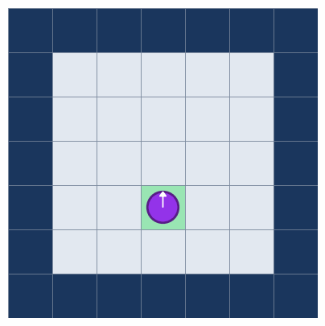

# Picobot Optimizer

[](https://www.python.org/downloads/)
[](https://creativecommons.org/licenses/by-nc-sa/4.0/)

**Revisiting decade-old Picobot solutions from Harvey Mudd's CS for All course**

<div align="center">
  
</div>

---

## Overview

This project documents the optimization of Picobot solutions from Harvey Mudd's ["CS for All"](https://www.cs.hmc.edu/csforall/) course, revisiting handwritten notes from January 2015 to verify, test, and visualize the solutions.

**Key Achievements:**
- **Empty Room:** 7 rules → **6 rules** (the known minimum)
- **Maze:** 16 rules → **12 rules** (25% reduction)

**What is Picobot?** A simple robot that navigates rooms using rule-based programming. It can sense walls (North, East, West, South) and move in four directions. The challenge: write the minimum number of rules to achieve 100% coverage.

---

## Installation

```bash
# Clone the repository
git clone https://github.com/YOUR_USERNAME/picobot-optimizer.git
cd picobot-optimizer

# Install dependencies
pip install -r requirements.txt
```

---

## Quick Start

### Run Verification Tests

```bash
python -m tests.test_solutions
```

This tests both the empty room and maze solutions from all possible starting positions.

### Create Animations

```python
from picobot.visualizer import create_animation
from picobot.rooms import create_empty_room
from picobot.solutions.optimized import EMPTY_ROOM_OPTIMIZED

# Create a 15×15 room
room = create_empty_room(15, 15)

# Generate animation
create_animation(
    rules=EMPTY_ROOM_OPTIMIZED,
    room=room,
    seed=42,
    filename="my_picobot.gif"
)
```

---

## Project Structure

```
picobot-optimizer/
├── picobot/                    # Core package
│   ├── simulator.py           # Picobot simulation engine
│   ├── rooms.py               # Room and maze builders
│   ├── visualizer.py          # GIF animation generator
│   └── solutions/             # Rule solutions
│       ├── initial.py         # Original 2015 solutions
│       └── optimized.py       # Optimized solutions
├── tests/                     # Test suite
│   └── test_solutions.py      # Verification tests
├── animations/                # Generated GIFs
├── docs/                      # Project documentation
└── README.md
```

---

## Solutions

### Empty Room — 6 Rules (Optimized)

**Strategy:** Boustrophedon (ox-turning) pattern

**⚠️ Note:** Per lab specification, Picobot always starts in **State 0**. Our testing verified why: starting in State 1 or 2 results in incomplete coverage (~50%) because the pattern assumes entry from the top wall.

```
# State 0: Going North
0 x*** -> N 0    # Nothing North → keep going
0 N*** -> X 1    # Wall North → STAY PUT, switch to State 1

# State 1: Check East / Go East
1 *x** -> E 1    # Nothing East → go East
1 *E** -> W 2    # Wall East → switch to going West

# State 2: Going West
2 **x* -> W 2    # Nothing West → keep going
2 **W* -> S 1    # Wall West → go South, switch to State 1
```

**Key Insight:** The `X` (stay put) move is not wasted — it's a state transition that enables rule reuse. Instead of duplicating east-checking logic in State 0, we stay put and let State 1 handle it.

### Maze — 12 Rules (Optimized)

**Strategy:** Right-hand wall-following

```
# State 0: Going North (wall on East)
0 *x** -> E 1    # Nothing East → turn right
0 xE** -> N 0    # Wall East, nothing North → keep going
0 NE** -> X 2    # Wall North AND East → stay put, switch West

# State 1: Going East (wall on South)
1 ***x -> S 3    # Nothing South → turn right
1 *x*S -> E 1    # Wall South, nothing East → keep going
1 *E*S -> X 0    # Wall East AND South → stay put, switch North

# State 2: Going West (wall on North)
2 x*** -> N 0    # Nothing North → turn right
2 N*x* -> W 2    # Wall North, nothing West → keep going
2 N*W* -> X 3    # Wall North AND West → stay put, switch South

# State 3: Going South (wall on West)
3 **x* -> W 2    # Nothing West → turn right
3 **Wx -> S 3    # Wall West, nothing South → keep going
3 **WS -> X 1    # Wall West AND South → stay put, switch East
```

**Key Insight:** Collapse 4 rules per state → 3 rules by combining dead ends and left turns into a single rule. Rule ordering matters — the intersection check must come before the corridor check.

---

---

## Examples

### Creating Custom Animations

```python
from picobot.visualizer import create_animation
from picobot.rooms import create_empty_room, create_standard_maze
from picobot.solutions.optimized import EMPTY_ROOM_OPTIMIZED, MAZE_OPTIMIZED

# Empty room with random start
room = create_empty_room(15, 15)
create_animation(
    rules=EMPTY_ROOM_OPTIMIZED,
    room=room,
    seed=42,
    filename="empty_room.gif",
    duration=80,   # ms per frame
    loop=False     # Single playthrough
)

# Maze solution
maze = create_standard_maze()
create_animation(
    rules=MAZE_OPTIMIZED,
    maze,
    filename="maze_solution.gif"
)
```

### Running Simulations Programmatically

```python
from picobot.simulator import Picobot, parse_rules
from picobot.rooms import create_empty_room
from picobot.solutions.optimized import EMPTY_ROOM_OPTIMIZED

# Parse rules
rules = parse_rules(EMPTY_ROOM_OPTIMIZED)

# Create room and bot
room = create_empty_room(25, 25)
bot = Picobot(room, rules, start_pos=(12, 12))

# Run simulation
bot.run(max_steps=10000)

# Check results
print(f"Coverage: {bot.coverage_percentage:.1f}%")
print(f"Steps taken: {bot.step_count}")
print(f"Visited: {len(bot.visited)} cells")
```

---

---

## Verification Results

All solutions verified with 100% coverage from every possible starting position:

- **Empty Room (25×25):** 529/529 positions ✅
- **Maze (25×25):** 287/287 positions ✅

See [docs/PROJECT_STATUS.md](docs/PROJECT_STATUS.md) for detailed results.

---

## The Three Stages of Engineering

This project demonstrates the complete engineering cycle taught in "Make It Work, Make It Right, Make It Fast":

| Stage | Goal | Picobot Project | Status |
|-------|------|-----------------|--------|
| **Make it work** | Solve the problem | Picobot rules (2015) | ✅ Complete |
| **Make it right** | Clean, tested code | Python simulator | ✅ Complete |
| **Make it fast** | Optimize performance | Batch simulation | 📝 Planned |

Most CS courses stop at stage 1. This project completes all three, with optimization work documented for educational purposes.

---

## About This Project

This represents a collaboration between human insight and AI implementation:

- **Human (Matteo):** Original 2015 solutions, optimization insights, domain knowledge
- **AI (Claude):** Simulator implementation, exhaustive testing, documentation

The goal: validate decade-old work, make it reproducible, and document the optimization thinking for others to learn from.

**Related blog post:** [Coming soon]

---

## Contributing

This is primarily an educational/archival project, but suggestions and improvements are welcome! Feel free to:

- Report issues with the simulator
- Suggest visualization improvements  
- Share your own Picobot solutions

---

## References

- [Harvey Mudd CS for All](https://www.cs.hmc.edu/csforall/)
- [Picobot Online Simulator](https://www.cs.hmc.edu/picobot/)

---

## License

This project is licensed under [CC BY-NC-SA 4.0](https://creativecommons.org/licenses/by-nc-sa/4.0/) - see the [LICENSE](LICENSE) file for details.

**Why this license?**

This project builds upon Harvey Mudd College's CS5 course materials, which introduced the Picobot problem and provided the original problem specification. HMC licenses their CS5 materials under CC BY-NC-SA 4.0, explicitly stating "you're welcome to share and adapt these materials, with attribution, non-commercially. Even Picobot!" By using the same license, we honor their educational mission, ensure proper attribution, and maintain the spirit of open educational resources. This keeps the work freely available for learning while preventing commercial exploitation.

**Attribution:**
- Original Picobot concept: Harvey Mudd College CS for All course
- Solutions (2015): Matteo Niccoli  
- Simulator implementation (2026): Matteo Niccoli with Claude AI

---

**Author:** Matteo Niccoli  
**Original Solutions:** January 2015  
**Implementation & Documentation:** January 2026
